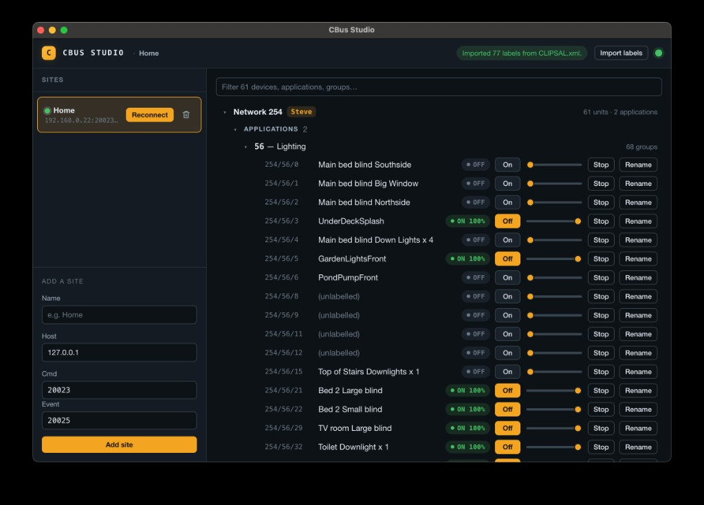

# CBus Studio

**Browse, test, and organize a Clipsal C-Bus network** — without needing a Windows
machine running C-Bus Toolkit.

<p align="center">
  <a href="docs/images/cbus-studio.png">
    
  </a>
</p>

<p align="center"><sub>Saved sites · live device tree · per-group controls · import/export labels</sub></p>

CBus Studio is an [Electron](https://www.electronjs.org/) app that talks to an
existing **C-Gate** server over TCP (the same documented command/event interface
that C-Bus Toolkit drives under the hood) and gives C-Bus owners a native GUI for
their network. It is an open-source community tool and deliberately does **not**
attempt Toolkit's proprietary unit-programming layer.

## Download

Pre-built installers for **macOS** (`.dmg`) and **Windows** (`.exe`) are attached
to each [GitHub Release](../../releases/latest). Grab the latest one, install, and
point it at your C-Gate server.

Builds are currently **unsigned** (no Apple Developer / Windows code-signing
certificate yet), so the OS will show the usual unidentified-developer warning on
first launch — on macOS, right-click the app and choose **Open**; on Windows,
choose **More info → Run anyway**.

## Why

C-Bus Toolkit is Windows-only, but the engine it drives — **C-Gate** — is pure
Java and already runs on macOS/Linux. The problem was never "port Toolkit to the
Mac"; it's "run the already-portable engine and build a native front-end against
its documented interface." CBus Studio is that front-end.

## Features

### Connect & Browse (M1)

- Save **multiple C-Gate sites** (one per location) — name + host + command/event
  ports — and switch between them with one click. Sites persist locally (in the
  app's `userData` directory) so installers don't re-type connection details.
  Edit a site anytime; optional C-Gate LOGIN credentials and default
  project/network are stored with the site.
- Connect to an existing C-Gate over TCP (command + event/status ports). Explicit
  **Disconnect** tears the session down without auto-reconnect.
- Pick the active **project** and **network** from the header session bar
  (`PROJECT DIR`/`LIST`/`LOAD`/`START`/`USE`, `NET LIST`) — no hardcoded network.
- **Network health** status bar: State / InterfaceState / SyncState, plus Open /
  Close / Sync. Lighting commands append `FORCE` automatically when the network
  is unsynced (`State=new`). Optional **Activity** drawer shows recent C-Gate
  command traffic.
- Render a **collapsible, filterable device tree** — networks → applications →
  groups, plus the **physical units** (dimmers, relays, switches) on each network
  with their type, firmware, and serial — parsed from `TREEXML`.
- Show **live state** (on/off + level) on each group, updated in real time from
  the C-Gate event stream.

### Operate & Test (M2)

- Toggle a group **on/off**, **dim** it with a level slider (sent as a `RAMP`),
  and **stop** an in-progress ramp — straight from the group's row in the tree.
- The UI updates optimistically and then tracks the real state reported back on
  the event stream, so you can verify wiring during an install.
- Transient commands only — **no database writes**.

### Organize (M3)

- **Rename** network / application / group labels inline.
- Edits are staged locally and shown as **unsaved changes**; nothing touches the
  C-Gate database until you explicitly confirm a **`PROJECT SAVE`** (gated behind
  a confirm-on-save banner).
- **Import labels** from a Clipsal C-Bus Toolkit project file — either a `.cbz`
  archive or the raw project `.xml`. CBus Studio reads the file locally, extracts
  the network / application / group tag names, and overlays them onto the tree
  (imported names are re-applied on every reconnect). This is **read-only
  enrichment** — it never writes to C-Gate. To push imported names into the
  project database, rename and `PROJECT SAVE` as above.

### Scenes (M4)

- **Fire C-Bus scenes** from the tree: trigger-control groups (application 202)
  render a **Fire** control (action-selector + button) instead of on/off, sending
  a transient trigger command — the same risk profile as M2 (no database writes,
  no scene *definitions* are created or edited).
- Trigger activity observed on the event stream is surfaced as a transient
  **last-fired** indicator.
- The tree now **reconciles live**: when another client (or Toolkit) renames,
  creates, or modifies an object, C-Gate's async object event triggers a
  debounced refresh so the view doesn't go stale.

### Sensors (M5)

- **Live measurement values** (C-Bus Measurement application 228) appear in a
  read-only **Sensors** section and update in real time from the event stream.
- Initial group levels are **hydrated in one bulk query** at connect (falling
  back to per-group reads), so large networks populate faster.

> **Note:** trigger fire (`TRIGGER EVENT`), measurement events, and per-application
> bulk `GET //proj/net/<app>/* level` are validated against C-Gate 3.3.2 — see
> `docs/smoke-checklist-m4.md` / `-m5.md` / `-m10.md`. Network-wide `GET …/* level`
> is rejected by 3.x when any application lacks `level`.

### Session & project (M6)

- Explicit **Disconnect** (no auto-reconnect). **Edit** a saved site any time
  (host, ports, optional LOGIN, default project/network).
- Header **project** picker: `PROJECT DIR` / `LIST` / `LOAD` / `START` / `USE`.
- Header **network** picker from `NET LIST` — no hardcoded network address.
- Project-qualified `TREEXML //project/<net>` with a bare-net fallback for older
  C-Gate.

### Network health (M7)

- **Open / Close / Sync** from the status bar (`NET OPEN` / `CLOSE`, `DO <net> SYNC`).
- Live **State / InterfaceState / SyncState**. Lighting commands append `FORCE`
  when the network is unsynced (`State=new`).
- Optional **Activity** drawer of recent C-Gate command traffic.

### Commission (M8)

- Dual mode: **Operate** (homeowner tree + controls) and **Commission**
  (inventory, filterable Groups workspace, scan/refresh, bulk on/off/level).
- Richer unit inspector — still no programming tabs.

### Tag DB (M9)

- Rename and **soft-delete** group TagNames (`DBSET …/TagName`, `<Unused>`),
  then persist with confirm-gated **`PROJECT SAVE`**.
- EntityPanel project SETs mark the dirty banner. Mismatch cue when TagName and
  live Name differ.
- Structural **add group** is not available on C-Gate 3.3.2 over TCP.

### Diagnostics (M10)

- **Identify** a physical unit (`ID`). C-Gate may return `521` if the unit is
  unavailable — the UI surfaces that instead of claiming success.
- **CSV** export of group tags alongside XML/CBZ.
- Keyboard: **`/`** focuses the visible filter; **Escape** clears it.

### Reliability

- Command-channel access is **serialized**, so a tree refresh can't interleave
  with a toggle or rename and corrupt either response.
- Both the command and event TCP streams use chunk-safe line buffering and
  `StringDecoder`, so events split across packets — or multibyte characters in
  labels — are reassembled correctly.

## Requirements

- A running **C-Gate** server reachable over TCP — default command port `20023`,
  event/status port `20025`. (CBus Studio connects to a C-Gate you already run; it
  does not bundle C-Gate or a JRE.)
- A **CNI (Ethernet)** C-Bus interface — everything is pure TCP. USB/serial PCI is
  out of scope.

## Safety

CBus Studio **only ever talks to C-Gate** — the same documented TCP command/event
interface that C-Bus Toolkit itself drives. It never speaks to the C-Bus units or
the CNI directly, never touches the bus electrically, and never downloads firmware
or unit programming. Everything it does is a request that C-Gate validates and
carries out on your behalf, exactly as Toolkit would.

Because of that, the risk of CBus Studio **damaging your equipment is minimal**:

- **Browsing** (M1) is entirely read-only.
- **Operate / Test** (M2) sends only transient `ON` / `OFF` / `RAMP` /
  `TERMINATE RAMP` commands — the same actions as flipping a switch on the wall.
  Nothing is written to the database, and state reverts to whatever your logic
  dictates.
- **Organize** (M3) only changes **labels**, and never persists anything until you
  explicitly confirm a `PROJECT SAVE`. It does not alter wiring, addressing,
  scenes, schedules, or device logic.

That said, **C-Bus controls real building services** (lighting, and potentially
loads where unexpected switching matters). Software cannot know what a given group
is wired to. So:

> ⚠️ **Always consult your C-Bus / C-Gate documentation and the equipment
> manuals**, and exercise the usual caution before operating groups on a live
> system — particularly anything beyond ordinary lighting. Test against a
> non-critical group first, and treat `PROJECT SAVE` (which writes to your project
> database) with the same care you would any change in C-Bus Toolkit. CBus Studio
> is provided **without warranty**; you are responsible for changes you make to
> your installation.

## Getting started

```bash
npm install          # install dependencies
npm run dev          # launch the app (electron-vite dev)
npm test             # run the Jest test suite
npm run test:coverage # run tests + enforce the 80% coverage threshold
npm run build        # production build (main + preload + renderer)
```

The full stack — `cgateweb/cgate-client`, the main-process `CgateService`, the
IPC/preload bridge, and the React renderer — is unit-tested (renderer components
via `@testing-library/react` under jsdom; all networked logic against the
in-process mock C-Gate). CI enforces a global **80% coverage** floor.

`npm run dev` opens the app window; add a **site** (name + C-Gate host + ports)
and click **Connect** to browse, operate, and rename items on the network. A
manual hardware-verification checklist lives in
[`docs/smoke-checklist-m1.md`](docs/smoke-checklist-m1.md).

> **Note on `PROJECT SAVE`:** rename + save writes to your live C-Gate project
> database. Verify the behaviour against a throwaway group before relying on it in
> production.

### Building installers

[`electron-builder`](https://www.electron.build/) produces native installers into
`release/`:

```bash
npm run dist:mac   # macOS universal .dmg + .zip (built on macOS)
npm run dist:win   # Windows x64 NSIS .exe installer (built on Windows)
npm run dist       # installer(s) for the current host platform
```

Each platform's installer must be built on that platform — the **Release**
GitHub Actions workflow does this on macOS and Windows runners and attaches the
results to the GitHub Release for a tag (see *Versioning & releases* below).

## Versioning & releases

Releases follow [Semantic Versioning](https://semver.org/) and are cut
**manually** — there is no automated version bumping:

1. Bump `"version"` in [`package.json`](package.json) and add an entry to
   [`CHANGELOG.md`](CHANGELOG.md); commit to `main`.
2. Tag that commit and push the tag:
   ```bash
   git tag v1.3.0
   git push origin v1.3.0
   ```
3. Pushing a `v*` tag triggers the **Release** workflow, which builds **macOS**
   (`.dmg` + `.zip`, universal Apple Silicon + Intel) and **Windows** (`.exe`
   NSIS) installers on native runners and publishes a **GitHub Release** for the
   tag with the installers attached.

To (re)build installers for an existing tag, run the workflow manually
(**Actions → Release → Run workflow**) and supply the tag. The workflow uses the
built-in `GITHUB_TOKEN`, so there are no extra secrets to configure.

## Architecture

```
┌─────────────────────── Electron app ───────────────────────┐
│  Renderer (React UI)          Main (Node)                   │
│  ┌──────────────────┐  IPC   ┌──────────────────────────┐   │
│  │ Site list / form │◄──────►│ CgateService             │   │
│  │ Device tree      │        │  ├─ SiteStore (persisted)│   │
│  │ Group controls   │        │  └─ cgateweb/cgate-client│───┼──TCP──► C-Gate ──► CNI ──► C-Bus
│  │ + rename / save  │        │     (conn, parsers,       │   │
│  └──────────────────┘        │      TREEXML, events)     │   │
│                              └──────────────────────────┘   │
└─────────────────────────────────────────────────────────────┘
```

- The **main process** owns all C-Gate I/O behind a `CgateService` facade. The
  **renderer never opens sockets** — it talks to main only over a typed,
  context-isolated IPC bridge (`contextIsolation: true`, a `preload` bridge, and
  `nodeIntegration: false`).
- All networked logic is tested against an **in-process mock C-Gate** TCP server, so
  the test suite needs no real hardware.

**Tech stack:** Electron, electron-vite, React, TypeScript, Jest, Node `net`.

## Relationship to cgateweb

CBus Studio depends on the protocol barrels from
[`cgateweb`](https://github.com/dougrathbone/cgateweb) (`cgateweb/cgate-client`,
pinned to a release tag). Import those subpaths — never the package root, which
is the MQTT/HA bridge application. TREEXML parsing, label export, and the
Studio-specific project-label parser stay in `src/cgate-client/`. See
[`docs/context/vendoring-cgate-client.md`](docs/context/vendoring-cgate-client.md).

## Non-goals

- **No unit programming** — downloading config/scenes/logic to physical devices is
  Toolkit's proprietary domain and out of scope.
- **No MQTT / Home Assistant** — that is `cgateweb`'s job.
- **No bundled C-Gate / JRE** — connect to a C-Gate you already run.
- **No serial/USB PCI** — CNI/Ethernet only.

## License

[ISC](LICENSE) — Copyright 2026 Doug Rathbone.
